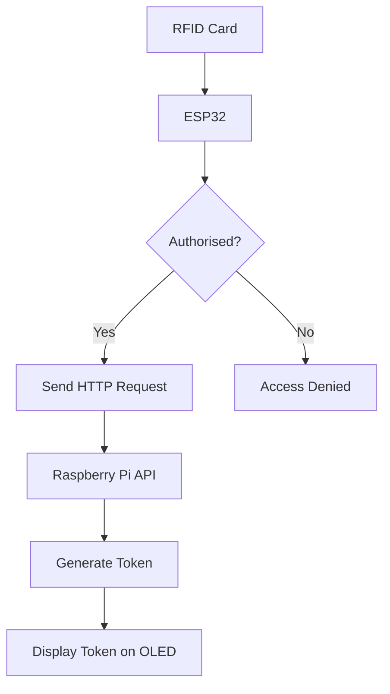

# ESP32 RFID Access Control System

A WiFi-enabled RFID access control system built using an ESP32, MFRC522 RFID reader, SH1106 OLED display, and a Raspberry Pi backend for token generation.

---

## Features

- RFID card authentication
- OLED display feedback
- WiFi connectivity
- HTTP communication with Raspberry Pi server
- Access control system with authorised users
- Token generation from backend service

---

## Hardware Used

- ESP32
- MFRC522 RFID Reader
- SH1106 OLED Display (I2C)
- RFID cards/tags
- Jumper wires
- (Optional) relay/lock module for physical access control

---

## Libraries Required

Install the following Arduino libraries:

- WiFi
- HTTPClient
- SPI
- MFRC522
- Wire
- Adafruit GFX
- Adafruit SH110X

---

## Pin Configuration

### RFID (SPI)
| Signal | Pin |
|--------|-----|
| SS     | 5   |
| RST    | 27  |
| SCK    | 18  |
| MISO   | 19  |
| MOSI   | 23  |

### OLED (I2C)
| Signal | Pin |
|--------|-----|
| SDA    | 21  |
| SCL    | 22  |
| Address| 0x3C |

---

## Authorised Cards

The system checks scanned RFID UIDs against a list of authorised users:

```cpp
{"22c6f939", "Ryan"}
{"66752d43", "Cormac"}

## System Architecture


